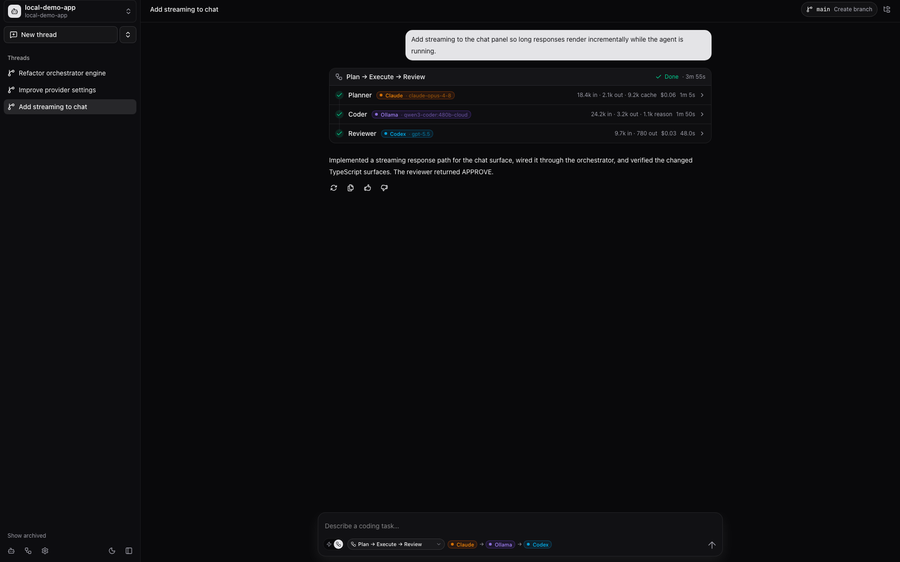
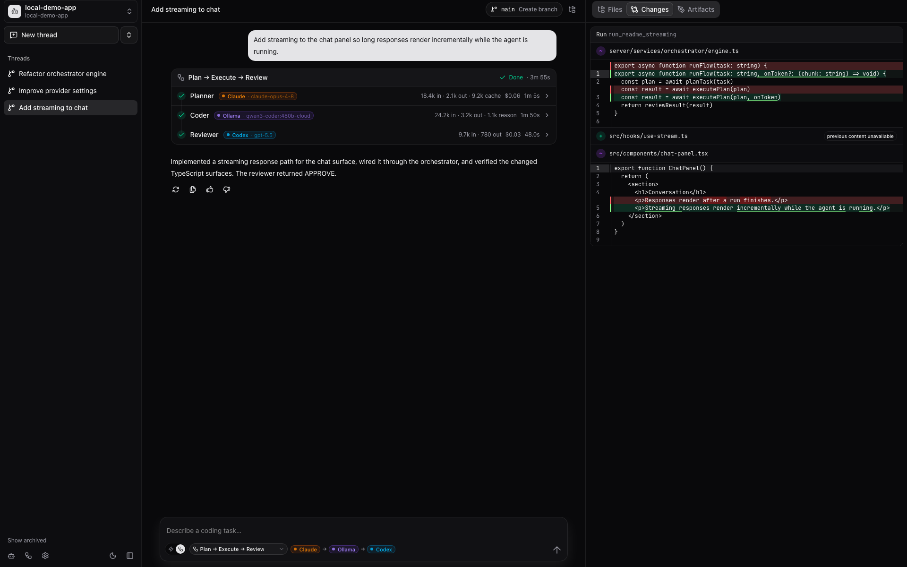
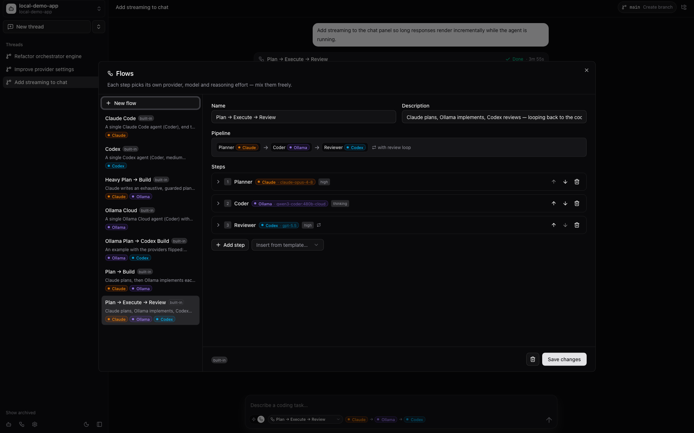
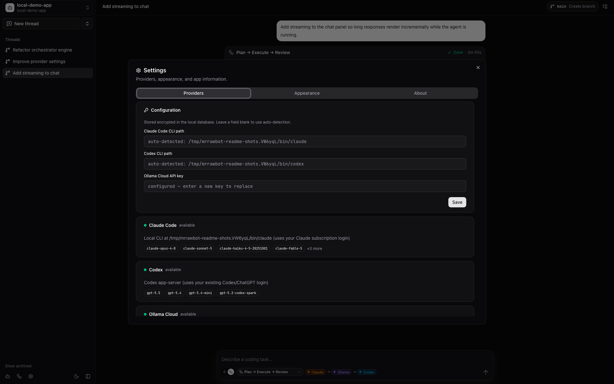

# Mr Rawbot

[](https://github.com/marcospcury/mrrawbot/actions/workflows/tests.yml)

**A local desktop cockpit for AI coding agents.**

Mr Rawbot brings Claude Code, Codex, and Ollama Cloud into one native app for working across the repositories on your machine. Start with a single-agent run, switch into multi-agent flows when the task needs planning or review, and keep the full conversation, run timeline, file browser, diffs, and provider setup in one place.

It is deliberately local-first: no hosted backend, no accounts, no telemetry, and no `.env` file. Your repositories stay on your computer; provider calls go only to the tools you configure.

---

## Screenshots

<table>
  <tr>
    <td width="50%">
      
      <br />
      <sub><strong>Thread workspace</strong> — chat, live run timeline, provider/model controls, and Git actions.</sub>
    </td>
    <td width="50%">
      
      <br />
      <sub><strong>Changes panel</strong> — per-run file changes and readable diffs beside the conversation.</sub>
    </td>
  </tr>
  <tr>
    <td width="50%">
      
      <br />
      <sub><strong>Flow builder</strong> — compose Claude, Ollama, and Codex into repeatable agent pipelines.</sub>
    </td>
    <td width="50%">
      
      <br />
      <sub><strong>Provider settings</strong> — local CLI detection and encrypted provider configuration.</sub>
    </td>
  </tr>
</table>

---

## What you get

- **One app for your local repos** — add tracked repositories automatically, or paste any folder path to work anywhere on disk.
- **Single-agent runs by default** — pick a provider, model, reasoning effort, and role; send the task; watch it work.
- **Multi-agent flows when useful** — chain planning, building, and review steps with provider-specific models and instructions.
- **Live execution visibility** — see each step, provider, model, duration, token usage, cost, logs, and final status as the run progresses.
- **Workspace side panel** — browse files, inspect artifacts, and review persisted changes without leaving the thread.
- **Local provider setup** — configure Claude Code, Codex, and Ollama Cloud from the UI; settings are encrypted in SQLite.
- **No permission toggles** — every agent always has full repository access by design, so the app behaves like a power tool instead of a hosted assistant.

---

## The safety model

Mr Rawbot is a personal, local power tool. It intentionally has **no permission system**.

Every agent and every model can read, write, create, and execute inside the selected repository. Claude runs with bypassed permissions, Codex runs with sandboxing disabled, and Ollama gets repository write tools plus local bash.

Only point Mr Rawbot at repositories you are comfortable letting an agent modify.

---

## How it works

1. **Add a repository** from the sidebar.
2. **Create a thread** for the task or product/design session.
3. **Choose the run mode**:
   - **Single agent** for fast, direct work.
   - **Flow** for planned or reviewed work.
4. **Send the task** and follow progress in the timeline.
5. **Review outputs** in chat, file diffs, or generated artifacts.

Built-in flows give you useful defaults immediately:

| Flow | Best for |
| --- | --- |
| Claude Code | A single Claude run from start to finish. |
| Codex | A single Codex run with medium reasoning effort. |
| Ollama Cloud | A single Ollama Cloud coding agent with repository tools. |
| Plan → Build | Claude plans; Ollama executes the plan step by step with completion checks. |
| Heavy Plan → Build | Claude writes a more exhaustive plan before Ollama executes. |
| Plan → Execute → Review | Claude plans; Ollama implements; Codex reviews and loops back until `APPROVE`. |
| Ollama Plan → Codex Build | Ollama plans; Codex implements. |

---

## Providers

| Provider | How Mr Rawbot uses it |
| --- | --- |
| **Claude Code** | Runs your local `claude` CLI through the Anthropic Agent SDK. Uses your existing subscription login, not an API key. |
| **Codex** | Runs through `codex app-server` using your existing `codex login`. |
| **Ollama Cloud** | Runs a LangGraph ReAct coding agent with repository tools and local bash. Requires an Ollama Cloud API key. |

Only configure the providers you want to use. The app shows availability and model lists in **Settings → Providers**.

---

## Install

Download the latest build from [Releases](https://github.com/marcospcury/mrrawbot/releases). macOS builds are provided as `.dmg` artifacts for Apple Silicon and Intel. Other platforms can run from source.

Two macOS packaging notes:

- **Node.js 24 must be on your `PATH`** for packaged builds. The desktop app starts its backend with your system Node so it can reuse your existing `claude` and `codex` logins.
- **The app is unsigned**, so macOS Gatekeeper may block first launch. Clear quarantine once:

```bash
xattr -dr com.apple.quarantine "/Applications/Mr Rawbot.app"
```

---

## Run from source

```bash
npm install
npm run dev      # web app at http://localhost:5173
# or
npm run app      # native Electron window
```

First-run setup happens in the app:

1. Open **Settings → Providers**.
2. Confirm `claude` and `codex` were detected, or set custom CLI paths.
3. Add an Ollama Cloud API key if you want Ollama runs.
4. Save. Values are stored encrypted in the local SQLite database.

---

## Configuration

There is no `.env` file. The UI is the source of truth for provider configuration.

Plain `MRRAWBOT_*` environment variables are available only as power-user overrides:

| Variable | Default | Purpose |
| --- | --- | --- |
| `MRRAWBOT_PORT` | `4000` | Backend port. |
| `MRRAWBOT_DB` | platform app-data directory | SQLite database path. |
| `MRRAWBOT_REPO_ROOTS` | `~` | Repo scan roots, separated by `:` or `,`. |
| `MRRAWBOT_REPO_SCAN_DEPTH` | `6` | Maximum depth for repo discovery. |
| `MRRAWBOT_CLAUDE_MODEL` | `claude-opus-4-8` | Default Claude model. |
| `MRRAWBOT_CODEX_MODEL` | `gpt-5.5` | Default Codex model. |
| `MRRAWBOT_OLLAMA_MODEL` | `qwen3-coder:480b-cloud` | Default Ollama Cloud model. |
| `MRRAWBOT_CLAUDE_BIN` / `MRRAWBOT_CODEX_BIN` | auto-detected from `PATH` | Override CLI paths. |
| `MRRAWBOT_CODEX_HOME` | `~/.codex` | Source for Codex `auth.json`; runtime uses an isolated app-managed Codex home. |
| `MRRAWBOT_OLLAMA_API_KEY` | — | Ollama Cloud key, normally saved through Settings instead. |
| `MRRAWBOT_DEBUG` | — | Set `1` for verbose provider logs. |

---

## Developer commands

| Command | Description |
| --- | --- |
| `npm run dev` | Start the backend and Vite frontend with hot reload. |
| `npm run app` | Build the frontend and launch Electron. |
| `npm run build` | Build the frontend to `dist/`. |
| `npm start` | Serve the built app from the backend on one port. |
| `npm run typecheck` | Type-check the full project. |
| `npm test` | Run the Vitest suite. |

---

## Technical shape

Mr Rawbot is a single ESM Node package: Electron shell, Vite/React frontend, Express backend, SQLite persistence, CopilotKit chat runtime, and LangGraph orchestration.

Runs are persisted per thread. The chat streams agent state snapshots into the UI, while the backend stores messages, run timelines, flows, provider settings, artifacts, and per-run file changes in SQLite.

Provider configuration saved in the UI is encrypted at rest with AES-256-GCM. The encryption key lives beside the database with restrictive file permissions. This protects against accidental plain-text dumps; it is not intended to defend against someone who already controls your machine.

---

## Releases

The project follows Semantic Versioning through Conventional Commits. `feat:` triggers a minor release, `fix:` triggers a patch release, and breaking changes use `feat!`, `fix!`, or a `BREAKING CHANGE:` footer.

release-please opens version/changelog PRs; CI builds release artifacts after tags are created.

---

## License

[MIT](LICENSE)
